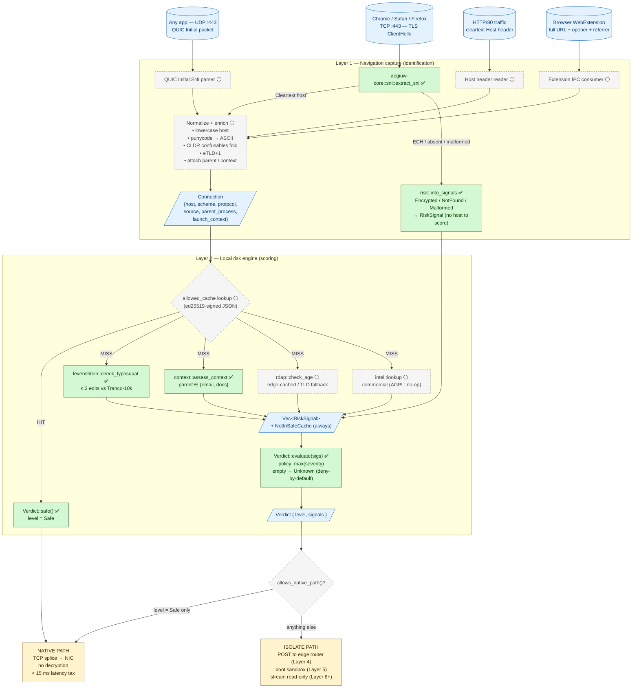

# Layer 1 + Layer 2 — Capture & scoring schema

This is the living diagram of how Aegiuw identifies an outbound web navigation
(Layer 1) and produces a verdict for it (Layer 2). Update in place as components
land; the legend uses ✅ for "built" and ⚪ for "planned."

GitHub renders the Mermaid block below as a real diagram in the file view.



## Severity ordering

The `RiskLevel` enum's *declaration order* is the severity order — that's what makes the fold policy literally `signals.iter().map(severity).max()`:

```
Safe  <  Unknown  <  Suspicious  <  HighRisk
```

## Signal → severity map

| Signal | Severity it asserts | Status |
|---|---|---|
| `NotInSafeCache` | `Unknown` | ✅ |
| `EncryptedClientHello` (ECH; C14) | `Unknown` | ✅ |
| `NoServerName` (no SNI in CH) | `Unknown` | ✅ |
| `MalformedClientHello` (non-TLS / probe) | `Unknown` | ✅ |
| `Typosquat { distance ≤ 2 }` | `Suspicious` | ✅ |
| `NewlyRegistered` | `Suspicious` | ⚪ |
| `RiskyLaunchContext` | `HighRisk` | ✅ |
| `KnownPhish` (commercial intel) | `HighRisk` | ⚪ |

The final `Verdict.level` is the *worst* of these. No weighted scoring, no thresholds — a single high-risk signal escalates the whole verdict.

The three SNI-outcome signals (`EncryptedClientHello` / `NoServerName` / `MalformedClientHello`, from `risk::into_signals` — SNI backlog I2) all assert `Unknown`: they fail-safe to Isolate without escalating, and exist as distinct variants for telemetry (PRD §1.1 distinguishes a malformed CH from a missing SNI, and ECH from both). `EncryptedClientHello` at `Unknown` is exactly DECISIONS.C14.

## Design notes worth preserving

- **Why parallel heuristics instead of short-circuiting after the first match?** Running all signals costs a few extra microseconds but gives the verdict the *full picture*. When a user asks "why was this isolated?" the answer is `["typosquat of microsoft.com", "launched from Outlook"]`, not the first signal that fired. That's both a UX win (Layer 8's audit log) and a debugging win. The allow-cache lookup is the *only* short-circuit, because a cryptographically-signed allow is definitive.
- **Why `max(severity)` and not weighted scoring?** Weights create a tunable knob, which creates a configuration surface, which creates support tickets. `max()` is unambiguous: a high-risk signal is high-risk, full stop. It also makes the type system itself encode the policy — declaration order *is* severity, so new signal variants slot into the right place without changes elsewhere.
- **Deliberate asymmetry between L1 and L2.** L1 has many sources (TCP, QUIC, HTTP, extension) but they all funnel into a single normalized `Connection` shape. L2's heuristics are therefore source-agnostic and stay easy to unit-test — and `aegiuw-core` stays I/O-free and WASM-friendly (confirmed: it compiles to `wasm32-unknown-unknown` per I3 / N76, so the same logic can run inside the Worker without a TS reimplementation).

## Build status (what's green above)

The `✅` nodes are wired end-to-end and demonstrated: `aegiuw-daemon` peeks a fixture ClientHello, runs `extract_sni` (I1), folds the outcome through `into_signals` (I2) and the typosquat / launch-context heuristics, and prints the fork verdict (`cargo run -p aegiuw-daemon`). What's still `⚪`: the privileged capture (TUN / QUIC / HTTP / extension sources), the signed allow-cache loader, RDAP age checks, and the actual NIC-vs-edge fork.

## Related decisions

- `DECISIONS.I1`/`I2`/`I3` — daemon ↔ core wiring, the SNI-outcome → RiskSignal adapter, and the WASM build confirmation.

- `DECISIONS.C13` — hybrid capture model (opaque-TCP + optional extension; no local CA).
- `DECISIONS.C14` — ECH fallback policy (unreadable SNI → isolate by default).
- `DECISIONS.C15` — intercept QUIC.
- `DECISIONS.C17` — top-level navigations only; no subresource isolation.
- `DECISIONS.D20`–`D25` — Layer 2 specifics (cache signing, threshold, RDAP, fail-mode).
